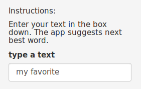
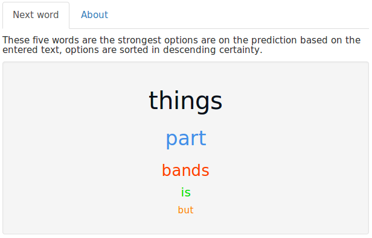

Overview
==================

This application was developed as part of data science specialization of Johns Hopkins University in Coursera. The application uses natural language processing to predict the next word based on the entered text.

The code of the application is posted on [github](https://github.com/anroco/PredictNextWord).

How to use it
==================

The application is easy to use, this is divided into two sections on the left side you will find a panel with a text box in which the words or phrases are typed, these will serve as a basis for predicting the next word. 

A list will show the result of prediction of the next words on the panel to the right of the page (Next word tab).

About
==================

This application was developed as the final Project of Data Science Capstone as part of the Data Science specialization by anroco.
